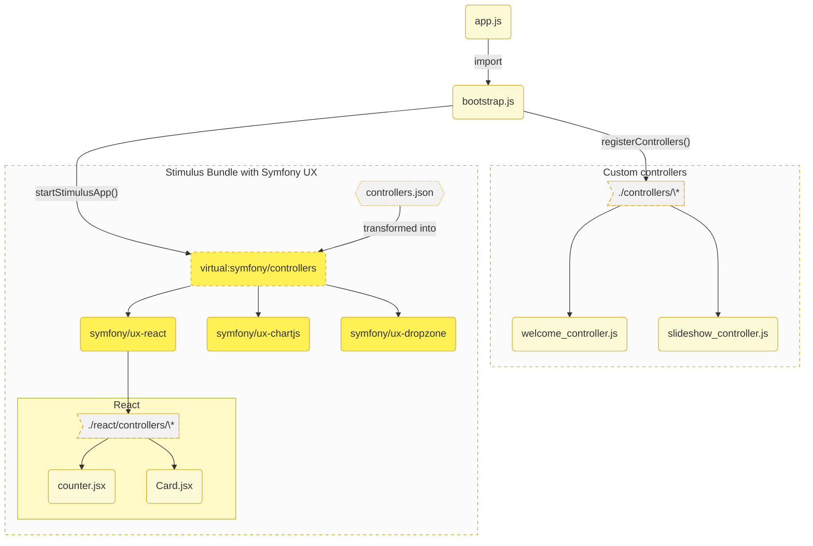

# Stimulus 

## Installation

::: warning
🧪 L'implémentation est encore expérimentale. Le code est totalement fonctionnel, certaines implémentations avec Symfony UX ne sont pas terminées (voir tableau des compatibilité en pied de page) et certains noms de fonctions peuvent être amenés à changer. Les fonctionnalités présentées dans cette page ne respecteront pas la sémantique de gestion de version `semver`.
:::

Stimulus est un framework Javascript léger qui a comme ambition de faciliter l'intégration de composants JavaScript dans un projet. Il connecte des objets JavaScript appelés `controllers` aux éléments HTML d'une page via les attributs `data-*`.



```bash
composer require symfony/stimulus-bundle

# désinstallez le package @symfony/stimulus-bridge
# uniquement compatible webpack
npm rm @symfony/stimulus-bridge
```

```js
// vite.config.js
import { defineConfig } from 'vite'
import symfonyPlugin from 'vite-plugin-symfony';

export default defineConfig({
  plugins: [
    symfonyPlugin({
      stimulus: true // [!code ++]

      // ou précisez le chemin de votre controllers.json
      // stimulus: './assets/other-dir/controllers.json'
    }),
  ],

  build: {
    rollupOptions: {
      input: {
        "app": "./assets/app.js",
      }
    }
  },
});
```

Si vous avez exécuté la recette Flex l'import a certainement déjà été ajouté.

```js
// assets/app.js
import './bootstrap.js';
```

Ajoutez les routines de génération d'une application stimulus compatible avec `symfony/stimulus-bundle` et `vite`.

```js
// assets/bootstrap.js

import { startStimulusApp, registerControllers } from "vite-plugin-symfony/stimulus/helpers"
const app = startStimulusApp();
registerControllers(
  app,
  import.meta.glob('./controllers/*_(lazy)\?controller.[jt]s(x)\?')
)
```
```twig
{# base.html.twig #}


  {{ vite_entry_link_tags('app') }}



  {{ vite_entry_script_tags('app') }}

```
```twig
{# in some template #}
<h1 {{ stimulus_controller('hello') }}></h1>
```

## Exemples

Le dépôt de développement [lhapaipai/symfony-vite-dev](https://github.com/lhapaipai/symfony-vite-dev) contient un dossier `playground/stimulus` regroupant une implémentation complète de Stimulus avec Symfony UX.


```bash
git clone https://github.com/lhapaipai/symfony-vite-dev.git
cd symfony-vite-dev
make install
cd playground/stimulus
composer install
npm i

symfony serve
npm run dev
```
