# Getting started

Vite is a tool to facilitate the development experience of modern web projects.


It provides:

- a development server which allows, among other things, the Hot Module Replacement of the generated code by taking advantage of the EcmaScript modules.

- a build command that uses [Rollup](https://rollupjs.org/).

## How does Vite works ?

```mermaid
%%{ init: { 'flowchart': { 'curve': 'bumpY' } } }%%
flowchart TD
    classDef file fill:#fcf9d7, stroke:#dba726;
    classDef service fill:#fff155, stroke:#dba726;
    classDef principal fill:#f2d63e, stroke:#c3830e;
    style twigFile fill:#fbfbfb, stroke-dasharray: 5 5;
    style assets fill:#fbfbfb, stroke-dasharray: 5 5;
    style browser fill:#fbfbfb, stroke-dasharray: 5 5;

    subgraph twigFile ["contact.html.twig"]
        twigFunctions("`vite_entry_script_tags('app')
        vite_entry_link_tags('app')`"):::file
    end

    subgraph assets [assets]
        cssFile("🎨 theme.scss"):::file
        jsFile("📜 app.js"):::file
    end

    framework((("`Symfony framework
    📦  **pentatrion/vite-bundle**`"))):::principal

    entrypointsJson("✨ entrypoints.json"):::file

    vite(("`⚡️Vite dev Server
        📦  **vite-plugin-symfony**
        listen **5173**`")):::service

    symfonyWebServer(("`Symfony local web server
        listen **8000**`")):::service

    subgraph browser ["Browser https://localhost:8000/contact html page"]
        direction TB
        viteClientTag("&lt;script src=&quot;https://localhost:5173/build/@vite/client&quot; /&gt;"):::file
        appTag("&lt;script src=&quot;https://localhost:5173/build/app.js&quot; /&gt;"):::file
    end

    framework --> symfonyWebServer -->|serve| browser
    twigFunctions -->|resolve| framework

    vite -->|⚙️ generate| entrypointsJson -->|use| framework

    vite <-->|🚀 web socket
    communicate events| browser
    jsFile & cssFile <-->|🧐 watch modifications| vite

    vite <-->|"🔥 HMR
    replace file when source is modified"| appTag
```



By default, Vite uses an `index.html` file as your application's entry point.

```html
<!DOCTYPE html>
<html lang="en">
  <head>
    <meta charset="UTF-8" />
    <title>Vite Project</title>
  </head>
  <body>
    <div id="app"></div>
    <script type="module" src="./src/main.ts"></script>
  </body>
</html>
```

When you launch Vite in development, it will launch an HTTP server on port 5173 and serve your `index.html` file by rewriting the urls of your `<script>` tags and assets.

Thus, a request to the address: `http://localhost:5173` will return your file `index.html` with the following code.

```html{4,10}
<!DOCTYPE html>
<html lang="en">
  <head>
    <script type="module" src="/@vite/client"></script>
    <meta charset="UTF-8" />
    <title>Vite in Dev mode</title>
  </head>
  <body>
    <div id="app"></div>
    <script type="module" src="/src/main.ts"></script>
  </body>
</html>
```

The code returned by `http://localhost:5173/src/main.ts` is your compiled entry point script.
The one returned by `http://localhost:5173/@client/client` corresponds to the script setting up a WebSocket between your browser and the Vite server. The latter allows the hot replacement of your code to optimize your development experience.

Finally, when you start building your code, Vite will rely on Rollup and generate an `index.html` file that looks like this.

```html{6,7}
<!DOCTYPE html>
<html lang="en">
  <head>
    <meta charset="UTF-8" />
    <title>Vite Build</title>
    <script type="module" crossorigin src="/assets/index-aa676a50.js"></script>
    <link rel="stylesheet" href="/assets/index-3443e464.css">
  </head>
  <body>
    <div id="app"></div>
  </body>
</html>
```

## How to integrate Vite into a Symfony application?

The operation of Vite is driven by the rewriting of the `<script>` and `<link>` tags, so it would be interesting to move this logic into Twig functions.

In Vite's configuration file, we define the `app` entry point of our application.

```js
// vite.config.js
export default defineConfig({
  build: {
    rollupOptions: {
      app: './path/to/app.js',
    },
  },
})
```

And then refer to that entry point in our Twig templates.

```html{6,7}
<!DOCTYPE html>
<html lang="en">
  <head>
    <meta charset="UTF-8" />
    <title>Vite Build</title>
    {{ vite_entry_script_tags('app') }}
    {{ vite_entry_link_tags('app') }}
  </head>
  <body>
    <div id="app"></div>
  </body>
</html>
```

Depending on the context of use (development or production) the Twig functions will return either a reference to the Vite development server or to static files generated after a build step.

For more info on integration see [Backend integration](https://vitejs.dev/guide/backend-integration.html).


## `vite-plugin-symfony` and `pentatrion/vite-bundle` extensions.

The `vite-plugin-symfony` extension for Vite and the `pentatrion/vite-bundle` Symfony bundle work together to provide a solution for this integration.

The main function of `vite-plugin-symfony` is to generate an `entrypoints.json` file. Like the `manifest.json` file, it will contain all the information about our entry points for server-side processing. This file will return different content if your Vite development server is started or if your files have been compiled.

::: code-group
```json [entrypoints.json (dev)]
{
  "isProd": false,
  "viteServer": {
    "origin": "http://[::1]:5173",
    "base": "/build/"
  },
  "entryPoints": {
    "app": {
      "js": [
        "http://[::1]:5173/build/src/app.ts"
      ]
    }
  },
  "legacy": false
}
```
```json [entrypoints.json (prod)]
{
  "entryPoints": {
    "app": {
      "assets": [],
      "css": [
        "/build/assets/app-3443e464.css"
      ],
      "js": [
        "/build/assets/app-6f6529cf.js"
      ],
      "legacy": false,
      "preload": []
    }
  },
  "isProd": true,
  "legacy": false,
  "viteServer": false
}
```
:::

The `pentatrion/vite-bundle` Symfony bundle will mainly provide the two Twig functions `vite_entry_script_tags` and `vite_entry_link_tags`. Under the hood these 2 functions will parse the generated `entrypoints.json` file and return the appropriate `<script>` and `<link>` tags.


::: code-group
```twig [index.html.twig]
{{ vite_entry_script_tags('app') }}
{{ vite_entry_link_tags('app') }}
```
```html [index.html (dev)]
<script type="module" src="http://[::1]:5173/@vite/client"></script>
<script type="module" src="http://[::1]:5173/build/src/app.ts"></script>
```
```html [index.html (prod)]
<script type="module" crossorigin src="/assets/app-6f6529cf.js"></script>
<link rel="stylesheet" href="/assets/app-3443e464.css">
```
:::

Now that we've seen the theory, let's see how to install all of this in your Symfony application!
