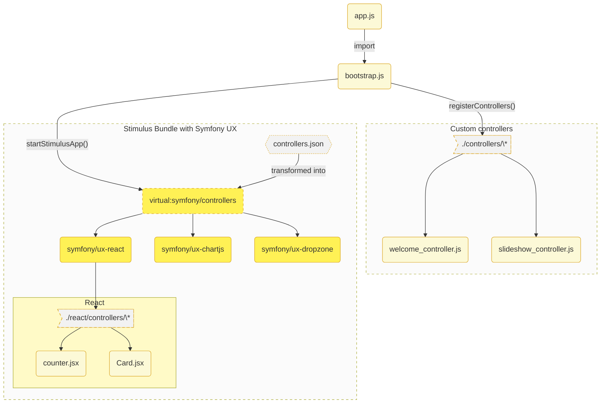

# Stimulus 

## Installation

::: warning
🧪 Please note that Stimulus implementation is marked unstable and may be subject to breaking changes without a major release. The code is fully functional, some implementations with Symfony UX are not finished (see compatibility table at the bottom of the page) and some function names may change.
:::

Stimulus is a lightweight JavaScript framework that aims to facilitate the integration of JavaScript components into a project. It connects JavaScript objects called `controllers` to HTML elements on a page via `data-*` attributes.



```bash
composer require symfony/stimulus-bundle

# remove the webpack-compatible @symfony/stimulus-bridge
npm rm @symfony/stimulus-bridge
```

```js
// vite.config.js
import { defineConfig } from 'vite'
import symfonyPlugin from 'vite-plugin-symfony';

export default defineConfig({
  plugins: [
    symfonyPlugin({
      stimulus: true // [!code ++]

      // or define custom path for your controllers.json
      // stimulus: './assets/other-dir/controllers.json'
    }),
  ],

  build: {
    rollupOptions: {
      input: {
        "app": "./assets/app.js",
      }
    }
  },
});
```

If you have run the Flex recipe the import has certainly already been added.

```js
// assets/app.js
import './bootstrap.js';
```

Add the routines for generating a stimulus application compatible with `symfony/stimulus-bundle` and `vite`.

```js
// assets/bootstrap.js

import { startStimulusApp, registerControllers } from "vite-plugin-symfony/stimulus/helpers"
const app = startStimulusApp();
registerControllers(
  app,
  import.meta.glob('./controllers/*_(lazy)\?controller.[jt]s(x)\?')
)
```
```twig
{# base.html.twig #}


  {{ vite_entry_link_tags('app') }}



  {{ vite_entry_script_tags('app') }}

```
```twig
{# in some template #}
<h1 {{ stimulus_controller('hello') }}></h1>
```

## Examples

The development repository [lhapaipai/symfony-vite-dev](https://github.com/lhapaipai/symfony-vite-dev) contains a `playground/stimulus` directory containing a complete implementation of Stimulus with Symfony UX.

```bash
git clone https://github.com/lhapaipai/symfony-vite-dev.git
cd symfony-vite-dev
make install
cd playground/stimulus
composer install
npm i

symfony serve
npm run dev
```
